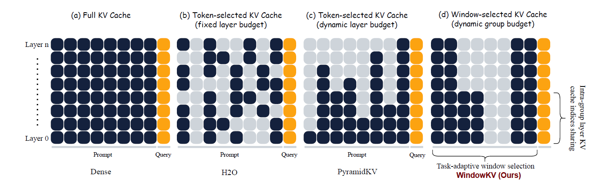
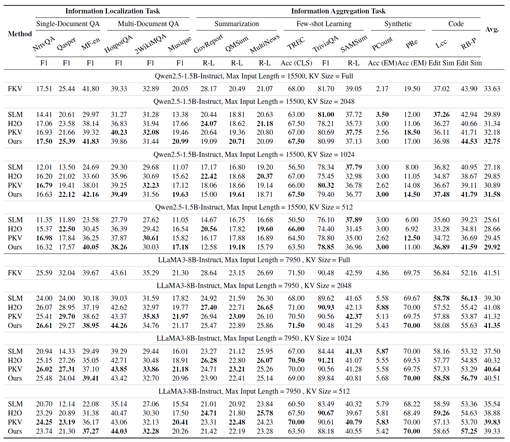
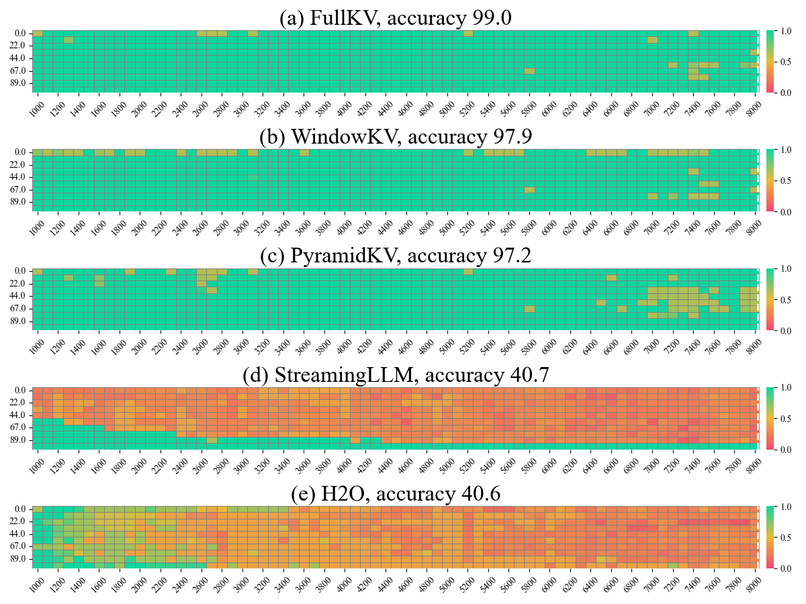

<h1 align="center" style="font-weight: bold;">WindowKV</h1>

<p align="center">
    <b>Code for paper: WindowKV: Task-Adaptive Group-Wise KV Cache Window Selection for Efficient LLM Inference.</b>
</p>


## 💡 Introduction

With the advancements in long-context inference capabilities of large language models (LLMs), the KV cache has become one of the foundational components. However, its substantial GPU memory consumption makes KV cache compression a key technique for enabling efficient LLM inference in industrial scenarios. While recent studies have focused on optimizing the memory occupied by the KV cache, they overlook two critical factors: preserving semantic coherence and regarding task-specific characteristic during compression. To address these limitations, we propose a novel task-adaptive KV cache window selection method, **WindowKV**. WindowKV dynamically selects local semantic windows consisting of consecutive tokens, according to task-specific characteristics, ensuring the retained KV cache captures continuous, essential context. Additionally, we introduce an intra-group layer KV cache indices sharing strategy to reduce computational overhead, achieving a balance between performance and efficiency. We rigorously evaluate WindowKV on the LongBench benchmark, and the results demonstrate that it maintains a performance comparable to full KV cache retention while using only 12% of the original KV cache, significantly reducing memory requirements. Furthermore, our method also achieves state-of-the-art results in the Needle-in-a-Haystack evaluation, highlighting its effectiveness and robustness.


In summary, our contributions are as follows:

- Different from previous KV cache compression methods that select discrete tokens, we introduce a task-adaptive window selection method, **WindowKV**. WindowKV dynamically compresses the KV cache based on task-specific characteristics while preserving the semantic coherence within local windows.
- Additionally, we propose an intra-group layer KV cache indices sharing strategy to reduce computational overhead, achieving a balance between performance and efficiency.
- Extensive experiments were conducted on the LongBench and Needle-in-a-Haystack benchmarks. The results demonstrate that WindowKV achieves the highest number of state-of-the-art results across various backbone LLMs and KV cache configurations on LongBench, while also surpassing other baseline methods on the Needle-in-a-Haystack test.


## 🚀 Getting started

### Requirements

```bash
accelerate==0.26.0
colorlog==6.8.2
flash-attn==2.6.3
fuzzywuzzy==0.18.0
jieba==0.42.1
python-Levenshtein==0.26.1
numpy==1.26.4
rouge==1.0.1
rouge_score==0.1.2
torch==2.2.2+cu121
transformers==4.46.0
```

### Installation

```bash
git clone ...
cd WindowKV
pip install -r requirements.txt .
```

### Inference

We support inference code on `LongBench`.

Please refer to `script/windowkv.sh` to modify the parameters according to your requirements.

```bash
max_capacity_prompt=2048 # 2048, 1024, 512.
attn_implementation="eager" # "eager" "flash_attention_2" "sdpa"

CUDA_VISIBLE_DEVICES="0" \
    /the/path/to/python -u \
    /the/path/to/WindowKV/run_demo.py \
    --model_type llama3_windowkv \
    --model_half \
    --use_cache \
    --attn_implementation ${attn_implementation} \
    --max_capacity_prompt ${max_capacity_prompt} \
    --review_window_size "8" \
    --shared_layers "8" \
    --suffix_max "32" \
    --suffix_avg "16" \
    --model_dir "/the/path/to/models_weight/Meta-Llama-3-8B-Instruct/" \
    --bert_model_dir "/the/path/to/models_weight/bert-base-cased" \
    --classifier_dir "/the/path/to/classifier_checkpoint/best_model.pth"
```

- model_type: The compression method being invoked.
- model_half: Loading the model in half precision.
- max_capacity_prompt: The average KV cache size across all layers.
- review_window_size: The number of tokens contained within a review window.
- shared_layers: The number of shared layers within a group.
- suffix_max: The size of the suffix window under the max window selection strategy.
- suffix_avg: The size of the suffix window under the average window selection strategy.
- model_dir: Path to your Meta-Llama-3-8B-Instruct.
- bert_model_dir: Path to your bert-base-cased.
- classifier_dir: Path to your classifier checkpoint.

After modifying parameters, run:

```bash
bash windowkv.sh
```

### Needle-in-a-Haystack

We follow PyramidKV's evaluation method, with the evaluation metric being Rouge-1 F1.


## ✨ Method





## 📊 Performance on LongBench




## 🐳 Results on Needle-in-a-Haystack




## 💖 Acknowledgement

We build our project based on [PyramidKV](https://github.com/Zefan-Cai/KVCache-Factory), [PyramidInfer](https://github.com/mutonix/pyramidinfer). Many thanks to them for providing open-source code!

